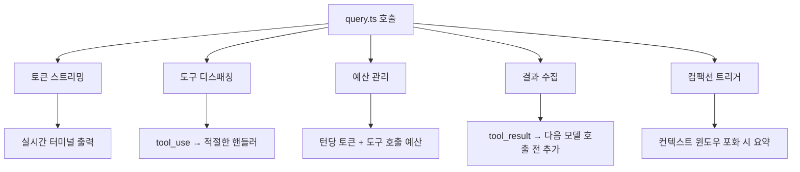

# Deep Dive: Claude Code 에이전틱 루프 완전 해부

> 작성일: 2026-03-31
> 원본 소스: Claude Code 공식 문서 (how-it-works, tools, agent, multi-agent, SDK overview)

---

## TL;DR

Claude Code는 **터미널에서 실행되는 에이전트 루프**다. 사용자 메시지를 받으면 (1) 컨텍스트를 조립하고 (2) Claude API에 전송하여 (3) 도구 호출을 받아 (4) 권한을 확인한 뒤 (5) 실행하고 (6) 결과를 다시 모델에 넘기는 과정을 **도구 호출이 없을 때까지** 반복한다. 원격 서버 없이 로컬 프로세스에서 전부 실행되며, 하위 에이전트(Task)를 생성해 병렬 처리도 가능하다. SDK를 통해 IDE, CI/CD, 헤드리스 데몬에 내장할 수 있다.

**핵심 키워드**: 에이전틱 루프, 도구 디스패칭, 권한 파이프라인, 컨텍스트 컴팩션, 서브 에이전트, SDK 제어 프로토콜

---

## 목차

1. [에이전틱 루프 전체 흐름](#1-에이전틱-루프-전체-흐름)
2. [컨텍스트 조립 과정](#2-컨텍스트-조립-과정)
3. [쿼리 엔진의 작동 방식](#3-쿼리-엔진의-작동-방식)
4. [도구 실행 모델과 권한 파이프라인](#4-도구-실행-모델과-권한-파이프라인)
5. [하위 에이전트(Task)와 멀티 에이전트 워크플로우](#5-하위-에이전트task와-멀티-에이전트-워크플로우)
6. [대화 저장과 재개 메커니즘](#6-대화-저장과-재개-메커니즘)
7. [SDK와 외부 통합](#7-sdk와-외부-통합)
8. [실무 활용 인사이트](#8-실무-활용-인사이트)

---

## 1. 에이전틱 루프 전체 흐름

Claude Code의 핵심은 **6단계 순환 프로세스**다. 이 루프는 전적으로 로컬 터미널 프로세스에서 실행되며, 원격 실행 서버가 없다.

### 1.1 전체 아키텍처 다이어그램

```
┌─────────────────────────────────────────────────────────┐
│                    Claude Code 프로세스                    │
│                   (로컬 터미널, 원격 서버 없음)               │
│                                                         │
│  ┌──────────┐    ┌──────────────┐    ┌───────────────┐  │
│  │ 1. 사용자  │───>│ 2. 컨텍스트   │───>│ 3. Claude API │  │
│  │   메시지   │    │    조립       │    │   추론/도구선택  │  │
│  └──────────┘    └──────────────┘    └───────┬───────┘  │
│       ^                                       │         │
│       │                                       v         │
│  ┌────┴─────┐    ┌──────────────┐    ┌───────────────┐  │
│  │ 6. 루프   │<───│ 5. 도구 실행  │<───│ 4. 권한 확인   │  │
│  │  지속/종료 │    │   결과 반환   │    │               │  │
│  └──────────┘    └──────────────┘    └───────────────┘  │
│                                                         │
│  ※ 도구 호출이 남지 않을 때까지 3→4→5→6→3 반복            │
└─────────────────────────────────────────────────────────┘
```

### 1.2 각 단계 상세

| 단계 | 이름 | 핵심 동작 | 관련 코드/모듈 |
|------|------|----------|---------------|
| **1** | 사용자 메시지 전송 | 터미널(대화형) 또는 `--print`/stdin(비대화형)으로 메시지 입력 | REPL / stdin 파이프 |
| **2** | 컨텍스트 조립 | 시스템 프롬프트 + 사용자 컨텍스트 구성, 메모이제이션 | `context.ts` |
| **3** | Claude 추론 | Anthropic API로 대화 전송, `tool_use` 블록 방출 | `query.ts` |
| **4** | 권한 확인 | 각 도구 호출의 권한 모드 평가 (allow/ask/deny) | 권한 파이프라인 |
| **5** | 도구 실행 | 승인된 도구 실행, `tool_result` 블록으로 결과 추가 | 도구 핸들러 |
| **6** | 루프 판단 | 추가 도구 호출 여부 확인, 있으면 3단계로 회귀 | `query.ts` |

### 1.3 루프 종료 조건

루프는 다음 중 하나가 만족되면 종료된다:

1. **모델이 도구 호출 없이 텍스트 응답만 생성** (정상 종료)
2. **턴당 토큰 예산 초과** (`error_max_turns`)
3. **비용 예산 초과** (`error_max_budget_usd`)
4. **구조화 출력 재시도 한도 초과** (`error_max_structured_output_retries`)
5. **사용자의 수동 중단** (`interrupt` 제어 요청)

> **실무 팁**: `--print` 모드에서 CI/CD 파이프라인에 Claude Code를 넣을 때, 반드시 비용 예산(`--max-budget-usd`)을 설정하라. 무한 루프 방지를 위한 안전장치다.

---

## 2. 컨텍스트 조립 과정

루프의 2단계에서 일어나는 컨텍스트 조립은 Claude가 현재 상황을 이해하는 기반이 된다.

### 2.1 시스템 컨텍스트 (`getSystemContext()`)

Git 환경 정보를 수집하여 시스템 프롬프트에 주입한다:

```
수집 항목:
├── 현재 브랜치 이름
├── 기본/메인 브랜치 (main 또는 master)
├── Git 사용자명
├── git status --short (2,000자 초과 시 잘림)
├── 최근 5개 커밋 (git log --oneline)
└── 캐시 무효화 주입 스트링 (디버깅용)
```

**스킵 조건**:
- `CLAUDE_CODE_REMOTE=1` 환경변수 설정 시
- 설정에서 git 지시사항 비활성화 시

### 2.2 사용자 컨텍스트 (`getUserContext()`)

CLAUDE.md 메모리 파일과 날짜 정보를 수집한다.

#### CLAUDE.md 4단계 계층 구조

```
우선순위 (높음 → 낮음)
┌──────────────────────────────────────┐
│  1. 관리(Admin) 레벨                  │  ← 조직 관리자 설정
├──────────────────────────────────────┤
│  2. 사용자(User) 레벨                 │  ← ~/.claude/CLAUDE.md
├──────────────────────────────────────┤
│  3. 프로젝트(Project) 레벨            │  ← 프로젝트 루트 CLAUDE.md
├──────────────────────────────────────┤
│  4. 로컬(Local) 레벨                  │  ← .claude/CLAUDE.local.md
└──────────────────────────────────────┘
```

- 4개 레벨 모두 발견된 내용이 합쳐져서 시스템 프롬프트에 포함됨
- `CLAUDE_CODE_DISABLE_CLAUDE_MDS=1`로 전체 비활성화 가능
- 현재 날짜는 `"Today's date is YYYY-MM-DD"` 형식으로 주입

### 2.3 메모이제이션

```
┌─────────────────────────────────────────────────┐
│                 메모이제이션 동작                    │
│                                                 │
│  getSystemContext() ──┐                         │
│                       ├── lodash/memoize 적용    │
│  getUserContext()  ──┘                          │
│                                                 │
│  - 대화 기간 동안 캐시됨 (= 세션 내 1회 계산)       │
│  - setSystemPromptInjection()으로 캐시 강제 초기화  │
│  - 새 세션 / resume 시 재계산                      │
└─────────────────────────────────────────────────┘
```

> **실무 팁**: CLAUDE.md를 수정해도 **진행 중인 대화에는 즉시 반영되지 않는다**. 새 세션을 시작하거나 `--resume`으로 재개해야 변경된 CLAUDE.md가 적용된다.

---

## 3. 쿼리 엔진의 작동 방식

각 루프 "턴"은 `query.ts`의 호출로 구동된다. 이것이 Claude Code의 심장부다.

### 3.1 쿼리 엔진의 5가지 핵심 기능



#### (1) 스트리밍

- API 응답을 실시간으로 터미널에 토큰 단위로 출력
- SDK 모드에서는 `stream_event` 타입으로 부분 토큰 전달
- 대화형 모드에서 React/Ink UI로 라이브 렌더링

#### (2) 도구 디스패칭

- 모델이 방출한 `tool_use` 블록을 파싱
- 각 도구의 핸들러 함수로 라우팅
- 결과를 `tool_result` 블록으로 변환하여 대화에 추가

#### (3) 예산 관리

두 가지 축으로 리소스를 관리한다:

| 예산 종류 | 설명 | 초과 시 |
|----------|------|---------|
| 턴 예산 | 최대 턴(모델 호출) 횟수 | `error_max_turns`로 종료 |
| 비용 예산 | 최대 USD 금액 | `error_max_budget_usd`로 종료 |

#### (4) 결과 크기 관리

```
도구 실행 결과 처리 흐름:

결과 생성 → 크기 확인 → maxResultSizeChars 초과?
                              │
                    ┌─────────┴─────────┐
                    │ No                │ Yes
                    v                   v
              결과 그대로 추가     임시 파일로 저장
                                  미리보기 + 파일 경로를
                                  모델에 전달
```

각 도구는 `maxResultSizeChars` 속성을 가지며, 결과가 이를 초과하면 임시 파일로 저장하여 컨텍스트 오버플로우를 방지한다.

#### (5) 컴팩션

```
대화 진행 →→→→→→→→→→→→→→→→→→→→→→→→→→→→→→→→→→
                                              │
컨텍스트 윈도우: [████████████████████░░░░] 80% ← 임계치 도달
                                              │
                    ┌─────────────────────────┘
                    v
            컴팩션 트리거
            - 오래된 메시지들을 요약으로 압축
            - 최근 메시지는 유지
            - API 전송 내용만 영향
            - 원본 트랜스크립트는 디스크에 보존
```

> **실무 팁**: 장시간 대화에서 "아까 말한 내용 기억해?"가 안 먹힐 수 있다. 컴팩션으로 요약된 부분이기 때문이다. 중요한 맥락은 대화 초반이 아닌 **직전 메시지에서 다시 언급**하는 것이 효과적이다. 또는 `/compact` 명령을 직접 사용하여 컴팩션 시점을 제어할 수 있다.

---

## 4. 도구 실행 모델과 권한 파이프라인

### 4.1 도구 분류 체계

Claude Code의 빌트인 도구는 크게 5개 카테고리로 나뉜다:

```
Claude Code 도구 체계
├── 파일 도구 (File Tools)
│   ├── Read     — 파일 읽기 (2,000줄, 이미지/PDF/노트북 지원)
│   ├── Edit     — 정확한 문자열 교체 (사전 읽기 필수)
│   ├── Write    — 새 파일 생성 / 완전 덮어쓰기
│   └── Glob     — 패턴 매칭 파일 검색
│
├── 셸 도구 (Shell Tool)
│   └── Bash     — 셸 명령 실행 (백그라운드 지원)
│
├── 검색 도구 (Search Tools)
│   ├── Grep     — Ripgrep 기반 정규식 검색
│   └── LS       — 디렉토리 목록
│
├── 웹 도구 (Web Tools)
│   ├── WebFetch — URL 콘텐츠 가져오기 (15분 캐시)
│   └── WebSearch— 웹 검색
│
├── 에이전트 도구 (Agent Tools)
│   ├── Task     — 서브 에이전트 생성
│   └── TodoWrite— 작업 목록 관리
│
└── MCP 도구
    └── mcp__*   — 외부 MCP 서버 제공 도구
```

### 4.2 권한 확인 파이프라인

모든 도구 호출은 실행 전 권한 파이프라인을 통과한다:

```
도구 호출 수신
    │
    v
┌────────────────────┐
│  권한 모드 확인      │
│                    │
│  bypassPermissions?│──Yes──> 즉시 실행 (모든 확인 스킵)
│                    │
└────────┬───────────┘
         │ No
         v
┌────────────────────┐
│  읽기 전용 도구?     │
│  (Read,Glob,Grep)  │──Yes──> 자동 승인 (모든 모드)
│                    │
└────────┬───────────┘
         │ No
         v
┌────────────────────┐
│  acceptEdits 모드?  │──Yes──> 파일 편집 도구: 자동 승인
│                    │         Bash 명령: 확인 요청
└────────┬───────────┘
         │ No (default 모드)
         v
┌────────────────────┐
│  권한 규칙 평가      │
│  (allow/deny 목록)  │
└────────┬───────────┘
         │
    ┌────┼────┐
    v    v    v
  allow  ask  deny
    │    │    │
    v    v    v
  실행  확인   거부
       대화   오류
       UI    반환
```

### 4.3 권한 결과별 동작 정리

| 결과 | 동작 | UI 표시 |
|------|------|---------|
| `allow` | 즉시 실행, 결과를 대화에 추가 | 없음 (투명하게 진행) |
| `ask` | 확인 대화 렌더링, 사용자 승인 대기 | "Allow?" 프롬프트 |
| `deny` | 호출 거부, 오류 결과를 모델에 반환 | 차단 알림 |

### 4.4 MCP 도구의 권한

- `mcp__` 접두사로 구분
- 일반 도구와 동일한 권한 규칙 적용
- 권한 규칙에서 deny 목록으로 특정 MCP 도구 차단 가능

> **실무 팁**: CI/CD에서 `bypassPermissions` 모드를 사용하면 모든 확인을 건너뛰지만, **보안 위험**이 있다. 프로덕션 환경에서는 `acceptEdits` 모드로 파일 편집만 자동 승인하고 Bash 명령은 제어하는 것이 권장된다.

---

## 5. 하위 에이전트(Task)와 멀티 에이전트 워크플로우

### 5.1 서브 에이전트 아키텍처

```
┌──────────────────────────────────────────────────┐
│                  부모 에이전트                      │
│              (메인 Claude Code 세션)                │
│                                                  │
│  Task(                                           │
│    description: "Run tests",                     │
│    prompt: "Run the full test suite...",          │
│    run_in_background: true                       │
│  )                                               │
│      │                          │                │
│      v                          v                │
│  ┌──────────────┐    ┌──────────────────┐       │
│  │  서브에이전트 A │    │  서브에이전트 B     │       │
│  │  (테스트 실행) │    │  (타입 체크)       │       │
│  │              │    │                  │       │
│  │  독립 컨텍스트 │    │  독립 컨텍스트     │       │
│  │  독립 도구세트 │    │  독립 도구세트     │       │
│  │  독립 권한모드 │    │  독립 권한모드     │       │
│  │              │    │                  │       │
│  │  결과 반환 ───┼────┼──> 부모에 병합     │       │
│  └──────────────┘    └──────────────────┘       │
│                                                  │
│  ※ 결과 크기 제한: 100,000자                       │
│  ※ 재귀적 포킹 방지 (평면 구조)                     │
└──────────────────────────────────────────────────┘
```

### 5.2 Task 도구 매개변수

| 매개변수 | 필수 | 타입 | 설명 |
|---------|------|------|------|
| `prompt` | O | string | 자체 포함적 작업 설명 (파일 경로, 줄 번호 포함) |
| `description` | O | string | 3~5단어 레이블 (UI 표시용) |
| `subagent_type` | X | string | 전문 에이전트 유형 |
| `model` | X | string | `"sonnet"`, `"opus"`, `"haiku"` |
| `run_in_background` | X | boolean | 백그라운드 비동기 실행 |
| `isolation` | X | string | `"worktree"` - git 워크트리 격리 |
| `cwd` | X | string | 작업 디렉토리 |
| `name` | X | string | SendMessage로 주소 지정 가능한 이름 |

### 5.3 포그라운드 vs 백그라운드 실행

```
포그라운드:                     백그라운드:
부모 → Task 생성 → 대기         부모 → Task 생성 → 다른 작업 계속
              │                                │
              v                                v
         결과 수신                          알림 수신 (완료 시)
              │                                │
              v                                v
         다음 작업                          결과 확인
```

### 5.4 컨텍스트 격리의 중요성

각 서브 에이전트는 **클린 컨텍스트 윈도우**로 시작한다. 부모의 대화 기록을 자동으로 상속받지 않는다.

```
부모 컨텍스트                    서브에이전트 컨텍스트
┌─────────────────┐            ┌──────────────────┐
│ 시스템 프롬프트    │            │ 시스템 프롬프트     │
│ 사용자 대화 30턴   │  ──X──>   │ prompt 매개변수만  │
│ 도구 결과들       │   상속안됨   │                  │
│ 중간 추론들       │            │                  │
└─────────────────┘            └──────────────────┘
```

따라서 프롬프트에 **충분한 맥락을 명시적으로 제공**해야 한다.

### 5.5 Worktree 격리

`isolation: "worktree"` 설정 시:

1. 임시 git worktree 생성
2. 서브 에이전트가 격리된 복사본에서 작업
3. 부모 에이전트의 파일과 충돌 없음
4. 완료 후 변경 사항 검토 및 병합 가능

### 5.6 에이전트 메모리 계층

서브 에이전트는 유형별로 지속적 메모리를 가질 수 있다:

```
메모리 범위:
├── 사용자 범위:   ~/.claude/agent-memory/
├── 프로젝트 범위:  .claude/agent-memory/
└── 로컬 범위:     .claude/agent-memory-local/
```

### 5.7 효과적인 프롬프트 작성 가이드

**좋은 프롬프트**:
```
Task({
  description: "Fix auth bug",
  prompt: `
    /src/auth/login.ts의 42번째 줄에서 JWT 토큰 검증이
    만료 시간을 확인하지 않는 버그가 있습니다.

    수정 사항:
    1. validateToken() 함수에서 exp 클레임 확인 추가
    2. 만료된 토큰에 대해 TokenExpiredError throw
    3. 기존 테스트 실행하여 통과 확인

    결과: 수정된 코드와 테스트 결과를 200단어 이내로 보고
  `
})
```

**나쁜 프롬프트**:
```
Task({
  description: "Fix bug",
  prompt: "로그인 관련 버그를 찾아서 수정해주세요"
  // 구체성 부족, 파일 경로 없음, 결과 형식 미지정
})
```

### 5.8 Task를 쓰면 안 되는 경우

| 작업 | 올바른 도구 |
|------|-----------|
| 특정 파일 하나 읽기 | `Read` |
| 클래스 정의 검색 | `Grep` |
| 2~3개 파일 내 검색 | `Read` 직접 사용 |
| 단순한 단일 명령 실행 | `Bash` |

> **실무 팁**: Task는 **오버헤드가 크다**. 독립 컨텍스트 생성, 시스템 프롬프트 재구성, 새 API 호출 등이 필요하다. 단순 작업에 Task를 쓰면 비용과 시간이 낭비된다. **5개 이상의 도구 호출이 필요한 복합 작업**에만 사용하라.

---

## 6. 대화 저장과 재개 메커니즘

### 6.1 저장 방식

```
~/.claude/
├── sessions/
│   ├── <session-id-1>.jsonl    ← 전체 트랜스크립트
│   ├── <session-id-2>.jsonl
│   └── ...
└── ...
```

- JSON Lines(JSONL) 형식으로 디스크에 저장
- 각 세션은 고유 세션 ID 보유
- 컴팩션된 내용이 아닌 **원본 트랜스크립트 전체** 보존

### 6.2 재개 방법

```bash
# 특정 세션 재개
claude --resume <session-id>

# 목록에서 선택
claude --resume
```

### 6.3 재개 시 동작 흐름

```
--resume 실행
    │
    v
┌──────────────────────┐
│ 전체 메시지 기록 로드   │
└──────────┬───────────┘
           │
           v
┌──────────────────────┐
│ CLAUDE.md 재발견       │ ← 처음과 다를 수 있음!
│ (4단계 계층 재탐색)     │
└──────────┬───────────┘
           │
           v
┌──────────────────────┐
│ 권한 모드 기본값 리셋   │ ← 세션에 저장되지 않은 경우
└──────────┬───────────┘
           │
           v
┌──────────────────────┐
│ 대화 계속              │
└──────────────────────┘
```

> **실무 팁**: `--resume`으로 재개하면 CLAUDE.md가 재발견되므로, 세션 중간에 CLAUDE.md를 수정한 후 `--resume`하면 변경 사항이 반영된다. 이를 활용하여 프로젝트별 지시사항을 동적으로 업데이트할 수 있다.

### 6.4 SDK를 통한 세션 관리

```typescript
import {
  listSessions,      // 저장된 세션 목록
  getSessionInfo,     // 세션 메타데이터
  getSessionMessages, // 트랜스크립트 읽기
  forkSession,        // 대화 분기
  renameSession,      // 이름 변경
  tagSession,         // 태그 부착
} from '@anthropic-ai/claude-code'

// 세션 분기 예시 — 특정 시점부터 다른 방향으로 대화
const { sessionId: newId } = await forkSession(originalId, {
  upToMessageId: 'msg-uuid',
  title: 'Experimental branch',
})
```

---

## 7. SDK와 외부 통합

### 7.1 SDK 동작 4단계

```
┌──────────┐     stdin      ┌──────────────┐     stdout     ┌──────────┐
│          │ ──────────────> │              │ ──────────────> │          │
│  호스트   │   JSON 메시지   │  Claude Code │   JSON 스트림   │  호스트   │
│  프로세스 │ <────────────── │   프로세스    │ <────────────── │  프로세스 │
│          │   제어 요청/응답  │              │   SDK 메시지    │          │
└──────────┘                └──────────────┘                └──────────┘

1단계: claude --output-format stream-json --print 으로 시작
2단계: initialize 제어 요청 전송 (시스템 프롬프트, 후크, 에이전트 정의)
3단계: stdout에서 줄 구분 JSON 스트리밍 수신
4단계: stdin으로 SDKUserMessage 전송하여 대화 계속
```

### 7.2 출력 형식 비교

| 형식 | 용도 | 특징 |
|------|------|------|
| `text` | 대화형 기본값 | 일반 텍스트만 |
| `json` | 일회성 스크립트 | 완료 시 단일 JSON 객체 |
| `stream-json` | SDK 통합 필수 | 줄 구분 JSON 스트림, 이벤트 즉시 방출 |

### 7.3 SDK 메시지 타입 흐름

```
세션 시작
    │
    v
[system/init] ─── 모델, 도구 목록, 권한 모드, 세션 ID
    │
    v
[assistant] ──── 모델 응답 (tool_use 블록 포함)
    │
    v
[stream_event] ── 부분 토큰 (점진적 렌더링용)
    │
    v
[tool_progress] ── 장시간 도구 상태 (경과 시간 포함)
    │
    v
[system/status] ── 상태 변경 (compacting 등)
    │
    v
[result] ──────── 턴 종료 (success/error + 비용/시간 정보)
```

### 7.4 주요 제어 요청 정리

| 요청 | 방향 | 용도 |
|------|------|------|
| `initialize` | 호스트->CLI | 세션 초기화, 프롬프트/후크/에이전트 설정 |
| `interrupt` | 호스트->CLI | 현재 턴 중단 |
| `set_permission_mode` | 호스트->CLI | 권한 모드 동적 변경 |
| `set_model` | 호스트->CLI | 모델 전환 |
| `can_use_tool` | CLI->호스트 | 도구 권한 확인 (SDK 측 처리) |
| `get_context_usage` | 호스트->CLI | 컨텍스트 윈도우 사용량 조회 |
| `rewind_files` | 호스트->CLI | 특정 메시지 이후 파일 변경 되돌리기 |
| `hook_callback` | CLI->호스트 | 후크 이벤트 전달 |

### 7.5 커스텀 서브에이전트 정의 (SDK 경유)

SDK의 `initialize` 요청에서 커스텀 에이전트를 정의할 수 있다:

```json
{
  "agents": {
    "CodeReviewer": {
      "description": "Reviews code for quality and security.",
      "prompt": "You are an expert code reviewer...",
      "model": "opus",
      "tools": ["Read", "Grep", "Glob"],
      "maxTurns": 10,
      "permissionMode": "default"
    }
  }
}
```

이 에이전트는 세션 중 `Task` 도구의 `subagent_type`으로 지정하여 사용 가능하다.

> **실무 팁**: IDE 통합 시 `PreToolUse` 후크를 등록하면 파일 편집을 가로채서 IDE의 네이티브 diff UI에서 미리보기 후 적용할 수 있다. VS Code 확장이 이 패턴을 활용한다.

---

## 8. 실무 활용 인사이트

### 8.1 에이전틱 루프를 이해하면 달라지는 것들

#### (1) 프롬프트 최적화

루프 구조를 이해하면 더 효율적인 프롬프트를 작성할 수 있다:

```
비효율적:                          효율적:
"이 프로젝트에서 버그를 찾아줘"      "src/auth/ 디렉토리의 login.ts에서
                                    JWT 만료 검증 누락 버그를 수정하고
→ 탐색 루프 10+ 턴                   tests/auth.test.ts 실행해줘"
→ 비용 증가
→ 컨텍스트 소모                     → 직접 도구 호출 2~3턴
                                    → 비용 절약
                                    → 컨텍스트 여유
```

#### (2) 비용 관리 전략

```
비용에 영향을 주는 요소:
├── 턴 수 (= API 호출 횟수)
├── 컨텍스트 크기 (= 입력 토큰)
├── 도구 결과 크기 (= 입력 토큰 증가)
└── 모델 선택 (opus > sonnet > haiku)

절약 전략:
├── 구체적 프롬프트로 턴 수 최소화
├── 불필요한 파일 읽기 방지
├── Task로 컨텍스트 분리 (메인 컨텍스트 보존)
├── 탐색 작업은 haiku 모델의 서브에이전트에 위임
└── --max-budget-usd 설정으로 상한선 관리
```

#### (3) 컨텍스트 윈도우 관리

```
효과적인 컨텍스트 관리:

1. 긴 대화 → /compact 명령으로 수동 컴팩션
2. 독립 작업 → Task로 분리 (메인 컨텍스트 오염 방지)
3. 큰 파일 → offset/limit으로 필요한 부분만 Read
4. 검색 결과 → Grep의 head_limit으로 결과 수 제한
5. 중요 맥락 → 최근 메시지에서 반복 언급 (컴팩션 대비)
```

### 8.2 CI/CD 파이프라인 통합 패턴

```bash
# 코드 리뷰 자동화
result=$(echo "Review the diff and output pass/fail" | \
  claude --output-format json --print \
         --permission-mode bypassPermissions \
         --max-budget-usd 0.50)

# 결과 파싱
status=$(echo "$result" | jq -r '.result')
```

### 8.3 멀티 에이전트 실전 패턴

```
패턴 1: 병렬 검증
├── 서브에이전트 A: 테스트 스위트 실행
├── 서브에이전트 B: 타입 체크
└── 서브에이전트 C: 린트 검사
    → 모든 결과를 부모가 종합하여 보고

패턴 2: 탐색 후 실행
├── 서브에이전트: 코드베이스 탐색 (haiku 모델)
└── 부모: 탐색 결과를 바탕으로 수정 실행 (opus 모델)
    → 탐색 비용 절약 + 수정 품질 확보

패턴 3: 격리된 실험
├── 서브에이전트 (worktree 격리): 리팩토링 시도
└── 부모: 결과 검토 후 병합 여부 결정
    → 메인 코드에 영향 없이 실험
```

### 8.4 CLAUDE.md 활용 전략

```
프로젝트 CLAUDE.md에 넣으면 효과적인 내용:
├── 프로젝트 구조 요약 (디렉토리 역할)
├── 코딩 컨벤션 (네이밍, 패턴)
├── 자주 쓰는 명령어 (빌드, 테스트, 배포)
├── 금지 사항 ("이 파일은 수정하지 마세요")
└── 선호하는 라이브러리 및 도구

넣으면 비효율적인 내용:
├── 너무 긴 문서 (컨텍스트 낭비)
├── 자주 변경되는 정보 (메모이제이션 때문에 세션 중 반영 안 됨)
└── 코드 전체 (Read 도구를 쓰는 게 나음)
```

### 8.5 디버깅 체크리스트

문제가 발생했을 때 확인할 순서:

```
1. 도구가 deny되고 있는가?
   → 권한 모드 확인, 필요 시 --permission-mode 변경

2. 컨텍스트가 부족한가?
   → /compact 후 중요 맥락 재전달
   → get_context_usage 제어 요청으로 사용량 확인

3. 도구 결과가 잘리고 있는가?
   → maxResultSizeChars 초과 여부 확인
   → 임시 파일로 저장된 전체 결과 확인

4. 서브에이전트가 잘못된 결과를 반환하는가?
   → 프롬프트에 충분한 맥락이 있는지 확인
   → 파일 경로, 줄 번호, 구체적 지시사항 포함 여부

5. 비용이 예상보다 높은가?
   → 턴 수 확인 (result 메시지의 num_turns)
   → 불필요한 도구 호출 패턴 식별
```

---

## 부록: 핵심 용어 정리

| 용어 | 설명 |
|------|------|
| **에이전틱 루프** | 사용자 메시지 → 추론 → 도구 실행 → 반복의 순환 구조 |
| **컨텍스트 조립** | 시스템/사용자 정보를 모아 프롬프트에 주입하는 과정 |
| **도구 디스패칭** | `tool_use` 블록을 적절한 핸들러로 라우팅하는 과정 |
| **컴팩션** | 장시간 대화에서 오래된 메시지를 요약하여 컨텍스트 절약 |
| **메모이제이션** | 세션 내 컨텍스트 계산 결과를 캐시하여 재사용 |
| **서브 에이전트** | Task 도구로 생성되는 독립적 Claude 인스턴스 |
| **워크트리 격리** | git worktree를 이용한 파일시스템 격리 실행 환경 |
| **SDK 제어 프로토콜** | stdin/stdout JSON 메시지로 Claude Code를 제어하는 인터페이스 |
| **권한 파이프라인** | 도구 실행 전 allow/ask/deny를 결정하는 검증 체계 |
| **MCP** | Model Context Protocol - 외부 도구 서버 연동 프로토콜 |
